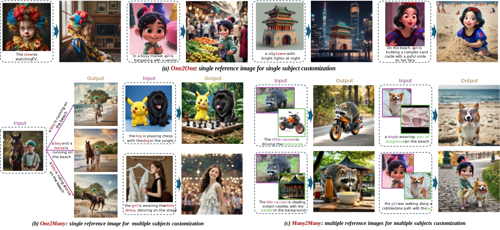
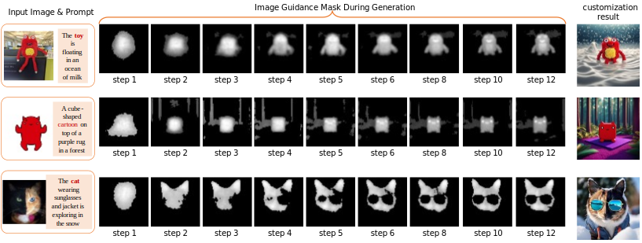

# RealCustom Series
<p align="center">

</p>

## 📖 Introduction

Existing text-to-image customization methods (i.e., subject-driven generation) face a fundamental challenge due to the entangled influence of visual and textual conditions. This inherent conflict forces a trade-off between subject fidelity and textual controllability, preventing simultaneous optimization of both objectives.We present RealCustom to disentangle subject similarity from text controllability and thereby allows both to be optimized simultaneously without conflicts. The core idea of RealCustom is to represent given subjects as real words that can be seamlessly integrated with given texts, and further leveraging the relevance between real words and image regions to disentangle visual condition from text condition.

<p align="center">

</p>

## ⚡️ Quick Start

### 🔧 Requirements and Installation

Install the requirements
```bash
bash envs/init.sh
```

### ✍️ Inference
```bash 
inference/inference_single_image.sh
```

### 🌟 Gradio Demo

```bash
python inference/app.py
```

##  Citation
If you find this project useful for your research, please consider citing our papers:
```bibtex
@inproceedings{huang2024realcustom,
  title={RealCustom: narrowing real text word for real-time open-domain text-to-image customization},
  author={Huang, Mengqi and Mao, Zhendong and Liu, Mingcong and He, Qian and Zhang, Yongdong},
  booktitle={Proceedings of the IEEE/CVF Conference on Computer Vision and Pattern Recognition},
  pages={7476--7485},
  year={2024}
}
@article{mao2024realcustom++,
  title={Realcustom++: Representing images as real-word for real-time customization},
  author={Mao, Zhendong and Huang, Mengqi and Ding, Fei and Liu, Mingcong and He, Qian and Zhang, Yongdong},
  journal={arXiv preprint arXiv:2408.09744},
  year={2024}
}
```